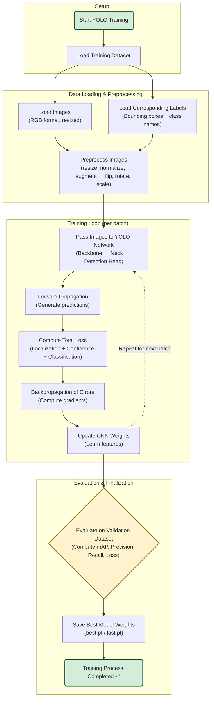
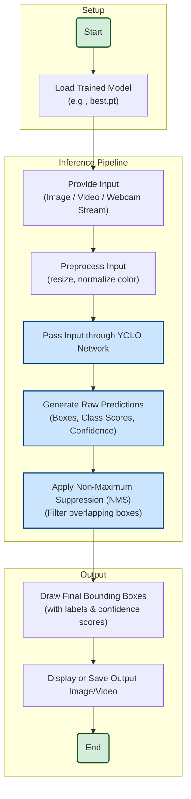

# **Project** : Object Detection Using Ml
## **Overview**
This project focus on detecting and localizing objects within Images and also offers detection in real time using machine learning and deep Learning techniques .The goal is to  build a Model that can accurately identify multiple objects in real time or static images and draw bounding boxes around them 

It leverages a **deep neural netwoork (DNN)** trained on a lable dataset and implemented using **YOLO(You Only Look Once)** -- one of the most fastest and most accurate object detection frameworks.

## Objectives
- To build an object detection model using YOLO architecture.
-To train the model on a custom or standard dataset.
- To evaluate detection accuracy and visualize the results.
- To deploy the trained model for real-time object detection using webcam/video feed.
## Project Structure 
```
Object-Detection-ML/
│
├── data/                   # Dataset and labels
│   ├── images/
│   ├── labels/
│   └── data.yaml
│
├── runs/                   # Trained model outputs
│   └── detect/
│       └── train/
│           └── weights/
│               └── best.pt
│
├── testImages/             # Test images for prediction
├── output/                 # Output images with detections
│
├── train.py                # Script to train the model
├── detect.py               # Script to run detection on images or webcam
├── requirements.txt        # Python dependencies
└── README.md               # Project documentation

```

## Installation 
 ### 1. Clone  the Repository
 ``` bash
 git clone https://github.com/yourusername/object-detection-ml.git

cd object-detection-ml
```
### 2. Install Dependencies 
``` bash
pip install -r requirements.txt
```
### 3. Verify Yolo Installation
```bash
pip install ultralytics
```
## Run 
For testting run ` Object_detect.py or Live_detection.py`

# Project Details
## What is YOLO ?

### Introduction 
**YOLO (You Only Look Once)** is a deep learning–based object detection algorithm that treats detection as a single regression problem, predicting bounding boxes and class probabilities directly from an image in one evaluation.
It is extremely fast, accurate, and suitable for real-time detection.

#### **Working of YOLO**
1. **Single Forward Pass:**<br>
The image is divided into a grid (e.g., 13×13). Each grid cell predicts:
- Bounding box coordinates (x, y, width, height)
- Confidence score
- Class probabilities

2. **Bounding Box Prediction:**<br>
Each cell predicts several bounding boxes, and the box with the highest confidence is selected.

3. **Non-Maximum Suppression (NMS):** <br>
Removes overlapping boxes to ensure only the best one remains for each object.

4. **Output:**<br>
YOLO outputs the class name, confidence, and bounding box coordinates for each detected object.

**Versions**

- YOLOv1–YOLOv3: Original implementations with Darknet framework.

- YOLOv4 & YOLOv5: Improved accuracy and speed using PyTorch.

- YOLOv8 / YOLOv11: Modern implementations by Ultralytics with enhanced performance, Python API, and CLI to

In this project we have used YOLOv8 n as base Model.


## Wroking Process

### Dataset Preparation 
1. Collect all images for target classes (e.g., car, person, bottle ,etc.)
2. Annotate each image using annotation tools like **Labelimg** or **Roboflow** to generate bounding boxes . (As we are using YOLOv8n).
3. Export Annotations in YOLO format 

```
class_id  x_center  y_center  width  height
```
4. Create a `data.yalml` file 
``` yaml
tarin:/path to the/train/images # path to train dataset
val:/path to the/val/images # apth to the validation dataset
nc:3 # no of classes in the dataset
names:['bottle,'cup,'phone'] # classes names 
```

for training data set you can **COCO128** which you can download from here ,[download](https://drive.google.com/file/d/1Cs6scXuA7rBTTviusnAuQTunuFyqq-SM/view?usp=drive_link) 
### Train the Model
To Train the Model run the `train.py` file which does the following things :
* loads a base model (for our project it is YOLOv8n(nano)).
* Train the Model using following params : 
  * `imgsz` : it describes the size of the training dataset images to be converted into .(higher= better accuracy but slower training process)
  * `batch`: Number of images processed per iteration
  * `epochs`:Number of training cycles

### Results of Training
**Result Graph**


### Expalanation

1. **train/box_loss** <br>
    * **Meaning** - Measures how accurately the model predicts the bounding box coordinates (x, y, width, height) of detected objects.
    * **Goal:** Lower is better.

    * **Interpretation:**  The loss decreases gradually, meaning the model is learning to localize objects more precisely.

2. **train/cls_loss**<br>
    * Meaning: Classification loss — measures how well the model classifies detected objects into the correct categories.

    * Goal: Lower is better.

    * Interpretation: The curve decreases overall, indicating improved class prediction accuracy.

3. **train/dfl_loss**<br>
    * Meaning: Distribution Focal Loss, used to refine bounding box regression by modeling the distribution of box positions.

    * Goal: Lower is better.

    * Interpretation: Slightly decreasing, showing better bounding box quality over epochs.

4. **metrics/precision(B)**<br>
    * Meaning: Precision measures how many detected objects are actually correct.


    `Precision=True Positives /True Positives+ False Positives`

    * Goal: Higher is better.

    * Interpretation: Gradually increasing trend → fewer false positives as training continues.

5. **metrics/recall(B)**<br>
    * Meaning: Recall measures how many actual objects are detected by the model.

    `Recall=True Positives/True Positives + False Negatives`

    * Goal: Higher is better.

    * Interpretation: Consistent increase → the model is detecting more of the actual objects in the images.

6. **val/box_loss**<br>
    * Meaning: Bounding box loss during     validation (unseen data).

    * Goal: Should decrease similarly to `train/box_loss` without overfitting.

    * Interpretation: Smooth, steady decrease → good generalization.

7. **val/cls_loss**<br>
    * Meaning: Classification loss during validation.

    * Goal: Lower is better.

    * Interpretation: Declines steadily → consistent improvement in class predictions on validation data.

8. **val/dfl_loss**<br>
    * Meaning: DFL (Distribution Focal Loss) on validation set.

    * Goal: Lower is better.

    * Interpretation: Smooth decrease → bounding box regression is improving even on unseen images.

9. **metrics/mAP50(B)** <br>
    * Meaning: Mean Average Precision (mAP) at IoU threshold 0.5.

    Measures how well the model detects objects with at least 50% overlap with the ground truth.

    * Goal: Higher is better.

    * Interpretation: Gradual increase → the model is improving detection accuracy.

10. **metrics/mAP50-95(B)**<br>
    * Meaning: Average of mAP scores over IoU thresholds from 0.5 to 0.95 (stricter evaluation).

    * Goal: Higher is better.

    * Interpretation: Rising trend → model performance is improving across all difficulty levels.

### Output on Validation set(labled image => predicted image)
 


### Running Detection 
Use the trained weights to test detection on new images.

## Flowchart

### Trainning Process
**Type of Learning: Supervised Learning**
*During training, the YOLO model learns from labeled images — that is, each image has annotations specifying:
 * What objects are present (class labels)
 * Their locations (bounding box coordinates)
So, the model learns a mapping: **Input (Image) → Output (Bounding Boxes + Class Labels)**

### Inference FLowchart 



### Advantage of YOLO
* Real-time object detection
* End-to-end single pass network
* High detection accuracy
* Works efficiently on GPU and CPU
*Supports multiple classes simultaneously


## Future
* Integrate real-time object detection and multi-object tracking for live video streams.
* Expand training with larger and diverse custom datasets for improved robustness.
* Explore next-gen architectures such as YOLOv11

## Author 
**Bikram Sasmal.**<br>
B.Tech in Computer Science and Engineering<br>
GitHub: [Sbikram07](https://github.com/Sbikram07)
